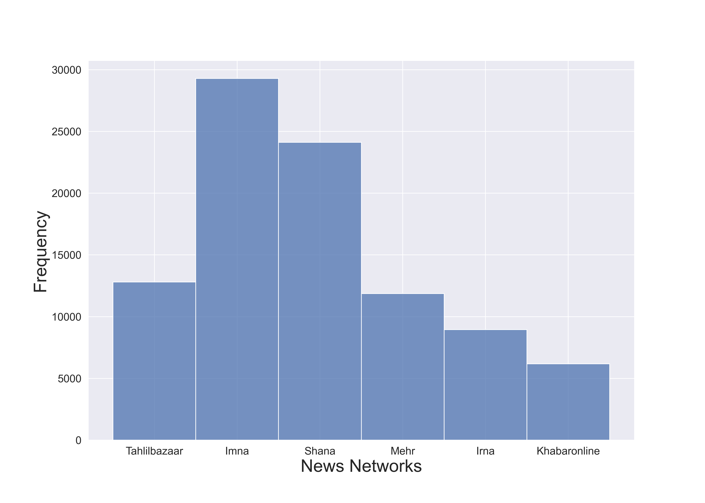
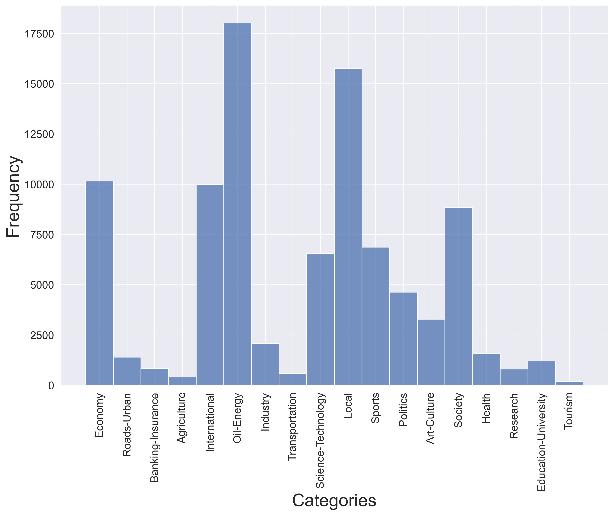
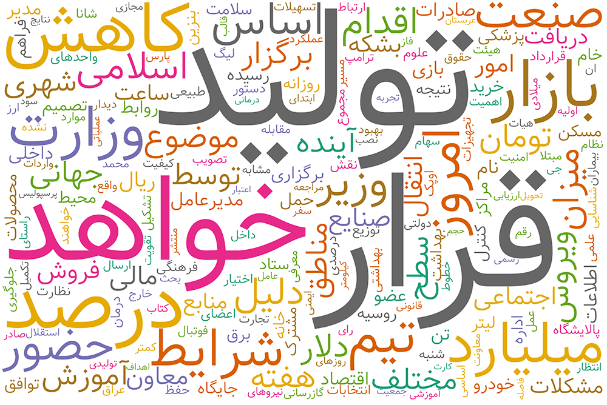
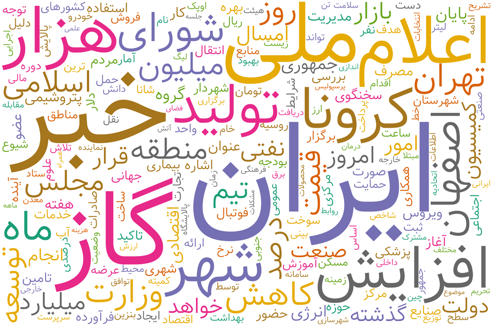

# Leveraging ParsBERT and Pretrained mT5 for Persian Abstractive Text Summarization
This repo presented a well-structured summarization dataset for the Persian language (like CNN, Daily News, ...). Also, this dataset covers 18 different news categories, which can be used for Text Classification. Furthermore, we tested out this dataset on novel models and techniques.

- mT5: A pretrained encoder-decoder model
- BERT2BERT: A leveraging ParsBERT model as an encoder-decoder architecture.

Follow the rest of the repo for more detail.

Paper link: [arXiv:2012.11204](https://arxiv.org/abs/2012.11204)

**Table of contents**
- [Leveraging ParsBERT and Pretrained mT5 for Persian Abstractive Text Summarization](#leveraging-parsbert-and-pretrained-mt5-for-persian-abstractive-text-summarization)
  - [Introduction](#introduction)
  - [Dataset Information](#dataset-information)
  - [Access/Download Dataset](#accessdownload-dataset)
    - [Download](#download)
    - [Dataset Demonstration](#dataset-demonstration)
    - [How to import](#how-to-import)
  - [Evaluation](#evaluation)
  - [Summarization Strategy](#summarization-strategy)
  - [A Few Examples](#a-few-examples)
  - [Citation](#citation)
  - [Contributors](#contributors)
  - [License](#license)

## Introduction
Natural Language Processing (NLP) is a field of AI that focuses on processing textual information in order to make them comprehensible to computers. With the emergence of Deep Learning (DL), numerous DL-based models and architectures have been proposed for different NLP tasks such as Named Entity Recognition (NER), Sentiment Analysis (SA), and Question/Answering (QA). One of the most recent and most popular approaches towards these tasks is to use pre-trained language models. Pre-trained language models used for NLP tasks are essentially huge neural networks employing Long Short-Term Memory (LSTM) architecture that is trained on an enormous text corpus. A few examples include [BERT](https://arxiv.org/abs/1810.04805) and [T5](https://arxiv.org/abs/1910.10683) models. BERT is an encoder-only model that uses Masked Language Model (MLM) to create joint conditioning in the left and right context. T5 is a Sequence-to-Sequence (Seq2Seq) framework that creates a text-to-text format to address NLP tasks. However, regardless of the architecture, any pre-trained model has to be fine-tuned towards any of the NLP tasks using an appropriate dataset.

There are numerous NLP datasets available for different tasks, especially for the English language. Some tasks, however, have had a lesser fortune regarding the amount of textual data available. This lack of available data is more tangible in languages other than English. One of the NLP tasks that could highly benefit from more comprehensive and well-structured datasets is text summarization. Text summarization is a text generation problem that could be viewed as a seq2seq mapping. The most challenging issue in text summarization is to retain as much information as possible while compressing the original text into a very compact format. Decoder-only or encoder-decoder models can be utilized to address this task if the necessary dataset is available to either train or fine-tune them.

In this repository, a novel and well-structured dataset for Persian text summarization (`pn-summary`) is presented. In the next few sections, first, we introduce the statistical features of this dataset. Then, we present the evaluation metrics that could be used to measure the performance of any model trained on this dataset. The results obtained from two different models in terms of said metrics are also presented.

## Dataset Information
The `pn-summary` dataset comprises numerous articles of various categories that have been crawled from six news agency websites. Each document (article) includes the long original text as well as a human-generated summary. The number of articles per news agency is depicted in the below figure. The total number of cleaned articles is 93,207 (from 200,000 crawled news).

<p align="center">
    <a href="assets/news_agencies.png"></a>
    <br>
    <em>Figure 1: CAPTION...</em>
</p>

This dataset includes 18 different article categories from economy to tourism. The distribution of these categories is shown below. The category with the highest and lowest number of articles are oil-energy and tourism, respectively. The top five categories are oil-energy, local, economy, international, and society.

<p align="center">
    <a href="assets/categories_dist.png"></a>
    <br>
    <em>Figure 2: CAPTION...</em>
</p>

Summaries included in each article have variable lengths. As shown in the next figure, most articles have summaries with around 27 tokens. Rarely it happens that a summary has 75 tokens, and almost none have 100 or more tokens. This shows that summaries included in this dataset are sufficiently short.

<p align="center">
    <a href="assets/summary_tokens.png"></a>
    <br>
    <em>Figure 3: CAPTION...</em>
</p>

Description ...
<p align="center">
    
    
    <br>
    <em>Figure 4: CAPTION...</em>
</p>

## Access/Download Dataset

### Download
You can download the pn-summary from the following table.

| Versions 	| Train 	| Validation 	| Test 	| All-In-One 	|
|:-:	|:-:	|:-:	|:-:	|:-:	|
| v1.0.0 	| (82022, 8) 	| (5592, 8) 	| (5593, 8) 	| [Download](http://bit.ly/pn-summary) 	|

### Dataset Demonstration
In the following table, you can a few examples of our dataset.

|  	| id 	| title 	| article 	| summary 	| category 	| categories 	| network 	| link 	|
|-	|-	|-	|-	|-	|-	|-	|-	|-	|
| 1 	| 738e296491f ... 	| مدیریت فروش نفت در دوران تحریم هوشمندانه عمل کرد 	| به گزارش شانا، علی کاردر امروز (۲۷ دی ماه) در مراسم تودیع محسن قمصری، مدیر سابق امور بین الملل شرکت ملی نفت ایران و معارفه سعید خوشرو، مدیر جدید امور بین الملل این شرکت، گفت: مدیریت امور بین‎الملل به عنوان یکی از تاثیرگذارترین مدیریت‌های شرکت ملی نفت ایران در دوران تحریم‌های ظالمانه غرب علیه کشورمان بسیار هوشمندانه عمل کرد و ما توانستیم به خوبی از عهده تحریم‌ها برآییم (...)    	| مدیرعامل شرکت ملی نفت، عملکرد مدیریت امور بین‎الملل این شرکت را در دوران تحریم بسیار هوشمندانه خواند و گفت: امور بین الملل در دوران پس از تحریم‎ها نیز می‌تواند نقش بزرگی در تسریع روند توسعه داشته باشد.   	| Oil-Energy 	| نفت 	| Shana 	| https://www.shana.ir/ ... 	|
| 2 	| 00fa692a17 ... 	| سبد محصولات پتروشیمی متنوع می‌شود 	| به گزارش شانا به نقل از شرکت ملی صنایع پتروشیمی، علی‌اصغر گودرزی‌فراهانی با اشاره به اینکه همه طرح‌های در حال اجرای صنعت پتروشیمی براساس پیشرفت فیزیکی و پیش‌بینی زمان راه‌اندازی در قالب طرح‌های جهش دوم و سوم تقسیم‌بندی شده‌اند، اظهار کرد: انتظار داریم که طرح‌های جهش دوم صنعت پتروشیمی که پیشرفت‌های (...)          	| سرپرست مدیریت برنامه‌ریزی و توسعه شرکت ملی صنایع پتروشیمی گفت: تنوع محصولات پتروشیمی ایران با بهره‌برداری از طرح‌های جهش دوم و سوم صنعت پتروشیمی افزایش می‌یابد.    	| Oil-Energy 	| پتروشیمی 	| Shana 	| https://www.shana.ir ... 	|

### How to import
```python
train = pd.read_csv('pn-summary/train.csv', sep="\t")
print(train.shape)

dev = pd.read_csv('pn-summary/dev.csv', sep="\t")
print(dev.shape)

test = pd.read_csv('pn-summary/test.csv', sep="\t")
print(test.shape) 

>>> (82022, 8)
>>> (5592, 8)
>>> (5593, 8)
```

## Evaluation
To evaluate the performance of any model trained on the `pn-summary` dataset, we suggest [Google's ROUGE](https://www.aclweb.org/anthology/W04-1013/) (Recall-Oriented Understudy for Gisting Evaluation) metric package. ROUGE metric package is a widely used automatic text summarization and machine translation evaluation. The metrics compare the generated summary with the original summary included in the article (document). Therefore, to establish the performance of any text summarization model, one can calculate the  score for these metrics.

In our most recent work [arXiv:2012.11204](https://arxiv.org/abs/2012.11204), which is the first work to address Persian text summarization from an abstractive point-of-view, we have reported the results of fine-tuning two models on the current dataset in terms of three ROUGE metrics:

1. **ROUGE-1 (unigram) scoring:** which computes the unigrams' overlap between the generated and the original summary.
2. **ROUGE-2 (bigram) scoring:** which computes the bigrams' overlap between the generated and the original summary.
3. **ROUGE-L scoring:** which computes the Longest Common Subsequence (LCS) between the the generated and the original summary. In this metrics scores are sentence-level and new lines are neglected.

ROUGE by default does not support the PErsian language. Therefore, we have also created an extension to these metrics to further support the Persian language. This extension is available [from here](https://github.com/hooshvare/pn-summary/tree/main/scripts).

The models proposed to be used for Persian summary generation in our work are [mT5](https://arxiv.org/abs/2010.11934) (a multilingual version of the T5 model) and a [BERT2BERT](https://arxiv.org/abs/1907.12461) structure warm-started with [ParsBERT](https://arxiv.org/abs/2012.11204) model's weights. This is the very first work ever that has used the pn-summary dataset. Therefore, the results reported in this work can be used as a baseline for any future work in this field that uses the pn-summary dataset. The results obtained by these models on the pn-summary dataset are presented in the table below:

|                   |  ROUGE-1  |  ROUGE-2  | ROUGE-L   |
|:-----------------:|:---------:|:---------:|-----------|
| B2B with ParsBERT | **44.01** | **25.07** | **37.76** |
|        mT5        |   42.25   |   24.36   | 35.94     |

As it can be seen from the table above, the ParsBERT-based BERT2BERT outperforms the mT5 model. This may be because ParsBERT, unlike mT5, is a monolingual BERT model that has exclusively been trained over a vast Persian text corpus capable of absorbing the Persian textual information more efficiently.

## Summarization Strategy
After the models are fine-tuned on the pn-summary dataset, a summarization strategy should be deployed to put the model into use actually to generate summaries. There are different decoding techniques such as *greedy search* and *beam search*. In our work, we have used the beam search method to generate summaries after fine-tuning our models. 

The beam search method tries to maximize the word sequence probability by considering multiple possible sequences (beams) and choosing the one that results in a greater conditional next word probability product. This is to avoid highly probable words being neglected only because they are stuck behind a low probability word. To prevent beam search from generating the sequences with repetitive words, we have used n-grams penalties. The overall beam search configuration used in our work is outlined in the table below. In this table, the early stopping indicates whether the beam search algorithm should stop when all beams reach the EOS token.

|                        | BERT2BERT |   mT5  |
|:----------------------:|:---------:|:------:|
|     Number of Beams    |     3     |    4   |
| Repetitive N-gram Size |     2     |    3   |
|     Length Penalty     |     2     |    1   |
|     Early Stopping     |   ACTIVE  | ACTIVE |


## A Few Examples
In this section, we have included a few examples from the results of the models presented in our paper. To make these examples more comprehensible, we have included both Persian and English versions of the example texts in the table below.

| # 	| Article - True Summary<br>Persian / English 	| BERT2BERT<br>Persian / English 	| mT5<br>Persian / English 	|
|:-:	|-:	|:-:	|:-:	|
| [1bd7bcbea425f8ff07d05feccaff51bbd8ef04de](https://www.irna.ir/news/84124380/%D9%85%D8%A7%D8%B1%D8%A7%D8%AF%D9%88%D9%86%D8%A7-%D8%AF%D8%B1-%DA%A9%D8%A7%D8%AE-%D8%B1%DB%8C%D8%A7%D8%B3%D8%AA-%D8%AC%D9%85%D9%87%D9%88%D8%B1%DB%8C-%D8%A2%D8%B1%DA%98%D8%A7%D9%86%D8%AA%DB%8C%D9%86-%D8%A8%D9%87-%D8%AE%D8%A7%DA%A9-%D8%B3%D9%BE%D8%B1%D8%AF%D9%87-%D9%85%DB%8C-%D8%B4%D9%88%D8%AF) 	| متن مقاله: به گزارش ایرنا، اسطوره تمام نشدنی آلبی سلسته شب گذشته (چهارشنبه) بر اثر حمله قلبی در ۶۰ سالگی چشم از جهان فرو بست. براساس اعلام خبرگزاری فرانسه و به نقل از ماریو هاک سخنگوی رییس جمهوری آرژانتین، پیکر مارادونا در کاخ کاسا روسادا به خاک سپرده خواهد شد تا عموم مردم بتوانند در فاصله روزهای پنجشنبه تا شنبه به قهرمان ورزشی خود ادای احترام کنند.<br>خلاصه مقاله:<br>دفتر رییس جمهوری آرژانتین اعلام کرد که پیکر دیگو مارادونا اسطوره فوتبال این کشور در کاخ ریاست جمهوری آرژانتین در بوئنوس آیرس به خاک سپرده خواهد شد.<br><br>Artice: Lorem ipsum dolor sit amet, consectetur adipiscing elit, sed do eiusmod tempor incididunt ut labore et dolore magna aliqua. Habitant morbi tristique senectus et netus et malesuada.<br>Summary: Lorem ipsum dolor sit amet, consectetur adipiscing elit, sed do eiusmod tempor incididunt ut labore et dolore magna aliqua. Habitant morbi tristique senectus et netus et malesuada. 	| براساس گزارش رسانه‌های ارژانتین دیگو مارادونا اسطوره فوتبال ارژانتین بر اثر ابتلا به سرطان چشم از جهان فرو بست.<br><br>Lorem ipsum dolor sit amet, consectetur adipiscing elit, sed do eiusmod tempor incididunt ut labore et dolore magna aliqua. Habitant morbi tristique senectus et netus et malesuada. 	| فوق ستاره اسبق تیم ملی آرژانتین پس از حمله قلبی در ۶۰ سالگی چشم از جهان فرو بست.<br><br>Lorem ipsum dolor sit amet, consectetur adipiscing elit, sed do eiusmod tempor incididunt ut labore et dolore magna aliqua. Habitant morbi tristique senectus et netus et malesuada. 	|
| [d0ca3de0f2a95e28da356963b26b2e46ea4100da](https://www.shana.ir/news/284594/%D8%A7%D8%B3%D8%AA%D9%85%D8%B1%D8%A7%D8%B1-%D8%A8%DB%8C-%D8%AB%D8%A8%D8%A7%D8%AA%DB%8C-%D8%AF%D8%B1-%D8%A8%D8%A7%D8%B2%D8%A7%D8%B1-%D9%86%D9%81%D8%AA-%D8%A8%D9%87-%D8%AF%D9%84%DB%8C%D9%84-%D8%B3%DB%8C%D8%A7%D8%B3%D8%AA-%D9%87%D8%A7%DB%8C-%D8%AA%D8%B1%D8%A7%D9%85%D9%BE) 	| متن خبر:‌ به گزارش خبرگزاری رویترز از نیویورک، قیمت شاخص نفت خام برنت دیروز پس از جهش اولیه، سرانجام ۹ سنت کاهش یافت و به ۷۸ دلار و ۹ سنت به ازای هر بشکه رسید. با این حال، قیمت شاخص نفت خام دبلیو‌تی‌آی آمریکا با ۴۰ سنت رشد، به ۶۸ دلار و ۹۹ سنت برای هر بشکه رسید (...)<br><br>خلاصه خبر: نگرانی درباره جنگ تجاری آمریکا و چین از یک سو و نگرانی درباره تحریم‌های ترامپ ضد ایران از سوی دیگر سبب شد قیمت نفت در معاملات دیروز (جمعه، ۲۴ شهریورماه) نوسان زیادی را تجربه کند.<br><br>Artice: Lorem ipsum dolor sit amet, consectetur adipiscing elit, sed do eiusmod tempor incididunt ut labore et dolore magna aliqua. Habitant morbi tristique senectus et netus et malesuada.<br><br>Summary: Lorem ipsum dolor sit amet, consectetur adipiscing elit, sed do eiusmod tempor incididunt ut labore et dolore magna aliqua. Habitant morbi tristique senectus et netus et malesuada. 	| قیمت شاخص نفت خام برنت دیروز پس از جهش اولیه، سرانجام ۹ سنت کاهش یافت و به ۷۸ دلار و ۹ سنت رسید.<br><br>Lorem ipsum dolor sit amet, consectetur adipiscing elit, sed do eiusmod tempor incididunt ut labore et dolore magna aliqua. Habitant morbi tristique senectus et netus et malesuada. 	| افزایش شمار دکل‌های حفاری در امریکا سبب شد قیمت نفت در معاملات دیروز ( دوشنبه ۲۲ اردیبهشت‌ماه ) کاهش یابد.<br><br>Lorem ipsum dolor sit amet, consectetur adipiscing elit, sed do eiusmod tempor incididunt ut labore et dolore magna aliqua. Habitant morbi tristique senectus et netus et malesuada. 	|


As shown from the table above, the summaries are given by ParsBERT driven BERT2BERT model are quite closer to the actual summary in terms of both meaning and lexical choices.
 
## Citation
Please cite the following paper in your publication if you are using our [dataset and architectures](https://arxiv.org/abs/2012.11204) in your research:

```bibtext
@article{pnSummary,
  title={Leveraging ParsBERT and Pretrained mT5 for Persian Abstractive Text Summarization}, 
  author={Mehrdad Farahani, Mohammad Gharachorloo, Mohammad Manthouri},
  year={2020},
  eprint={2012.11204},
  archivePrefix={arXiv},
  primaryClass={cs.CL}
}
```


## Contributors

- Mehrdad Farahani: [Linkedin](https://www.linkedin.com/in/m3hrdadfi/), [Twitter](https://twitter.com/m3hrdadfi), [Github](https://github.com/m3hrdadfi)
- Mohammad Gharachorloo:  [Linkedin](https://www.linkedin.com/in/mohammad-gharachorloo/), [Twitter](https://twitter.com/MGharachorloo), [Github](https://github.com/baarsaam)
- Mohammad Manthouri:  [Linkedin](https://www.linkedin.com/in/mohammad-manthouri-aka-mansouri-07030766/), [Twitter](https://twitter.com/mmanthouri), [Github](https://github.com/mmanthouri)

## License
[MIT License](LICENSE)
